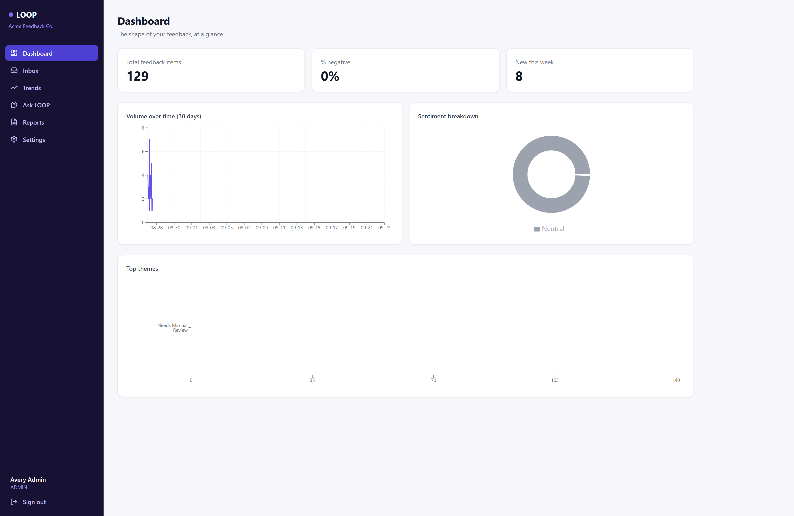
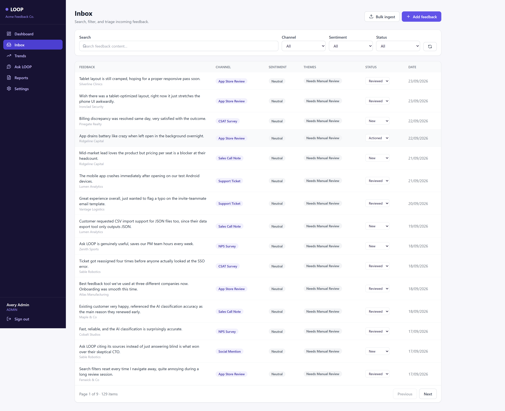
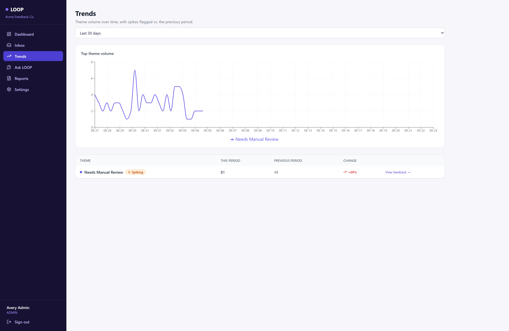
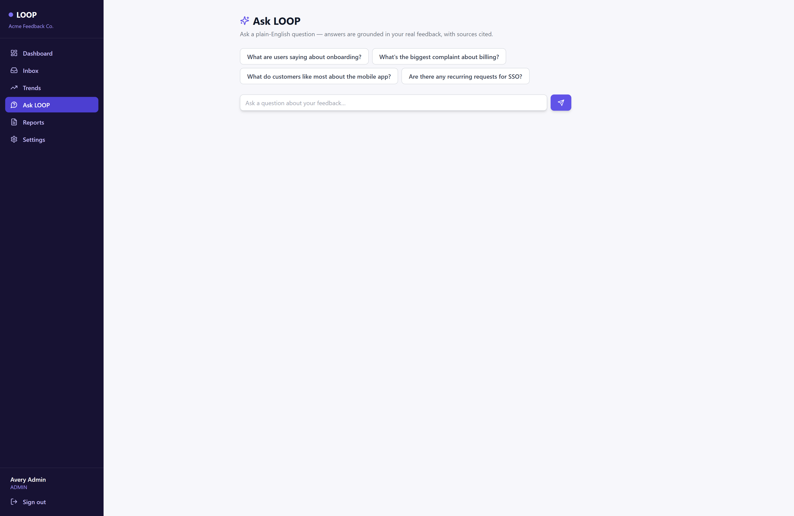
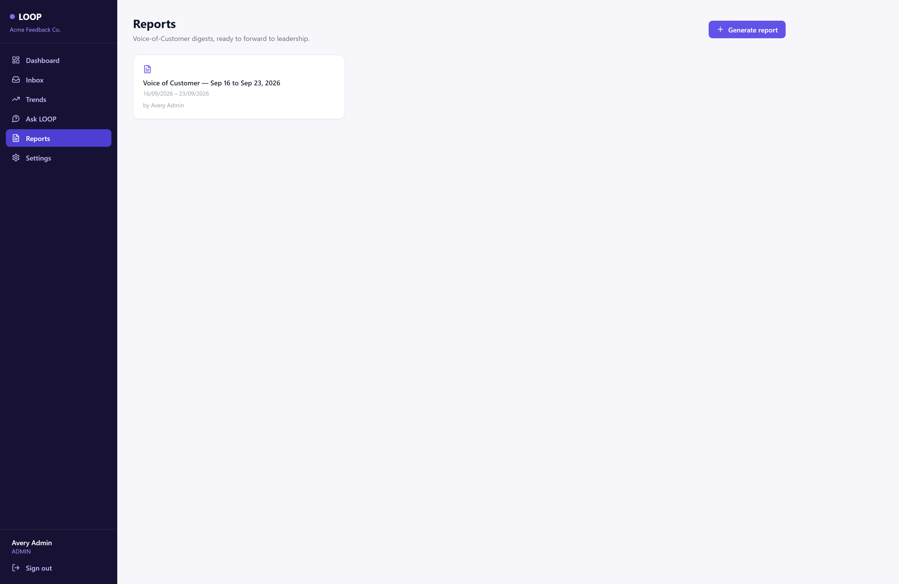
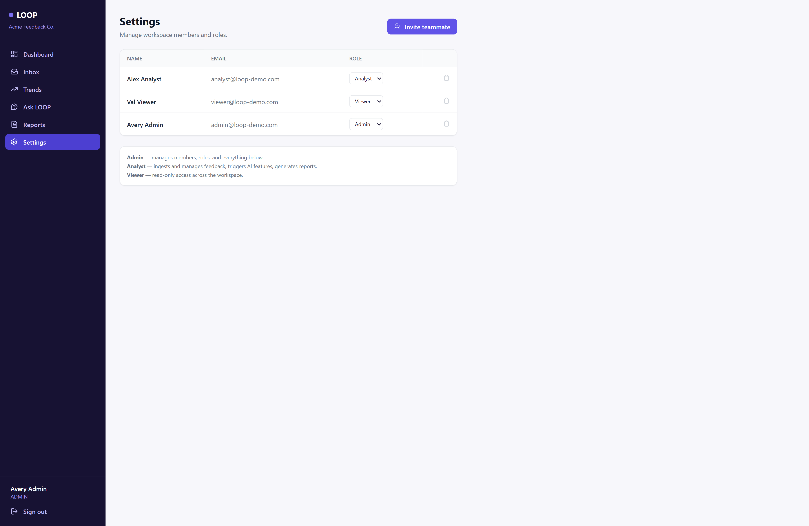

<div align="center">

# 🔁 LOOP

### AI Customer-Feedback Intelligence Platform

**Turn scattered customer feedback into clear, evidence-backed product insights.**

LOOP is a multi-tenant AI-powered customer-feedback intelligence platform that collects feedback from multiple sources, automatically classifies it, identifies emerging themes, tracks trends, and lets teams ask natural-language questions about what their customers are saying.

Built as a full-stack web application for the **Zidio Development Web Development Track**.

<br/>

[](https://nextjs.org/)
[](https://www.typescriptlang.org/)
[](https://react.dev/)
[](https://tailwindcss.com/)

[](https://www.postgresql.org/)
[](https://www.prisma.io/)
[](https://next-auth.js.org/)
[](https://ai.google.dev/)

[](https://zod.dev/)
[](https://recharts.org/)
[](https://vercel.com/)
[](#)

</div>

---

## 📌 Overview

Customer feedback arrives through support tickets, app-store reviews, surveys, sales conversations, and community channels. When this information is scattered across different systems, teams struggle to identify recurring problems and understand what customers actually need.

**LOOP** brings this feedback into one centralized platform and uses AI to transform raw feedback into structured insights.

The platform helps teams:

* Collect customer feedback from multiple sources
* Automatically classify sentiment and feature areas
* Organize feedback into meaningful themes
* Detect emerging trends
* Search and filter large feedback datasets
* Ask natural-language questions about customer feedback
* Generate Voice-of-Customer reports
* Manage access through workspace-based RBAC

> **LOOP — Close the loop on customer feedback.**

The project follows the core requirements of the Zidio Project LOOP brief, which calls for a multi-tenant feedback intelligence platform with authentication, RBAC, analytics, AI classification, theme analysis, grounded Q&A, and Voice-of-Customer reporting.

---

## ✨ Key Features

### 🏢 Multi-Tenant Workspaces

LOOP supports multiple isolated workspaces.

Each workspace has its own:

* Users
* Customer feedback
* Themes
* Reports
* Embeddings

All tenant-owned database queries are scoped using the authenticated user's `workspaceId`.

---

### 🔐 Authentication & Role-Based Access Control

The application implements three user roles:

| Role        | Permissions                                              |
| ----------- | -------------------------------------------------------- |
| **Admin**   | Full access + member and role management                 |
| **Analyst** | Manage feedback, trigger AI processing, generate reports |
| **Viewer**  | Read-only access                                         |

RBAC is enforced on the server rather than relying only on frontend UI restrictions.

---

### 📥 Feedback Ingestion

Feedback can be added through:

* Manual single-entry forms
* CSV bulk imports
* Simulated feedback channels

Supported feedback channels include:

* Support Tickets
* App Store Reviews
* NPS Surveys
* CSAT Surveys
* Sales Call Notes
* Social Mentions
* CSV Imports
* Manual Entries

CSV imports validate rows and provide import success/failure information.

---

### 📬 Feedback Inbox

The feedback inbox provides:

* Server-side pagination
* Full-text search
* Channel filtering
* Sentiment filtering
* Theme filtering
* Status filtering
* Date-range filtering
* Inline status updates

Feedback follows the workflow:

```text
NEW → REVIEWED → ACTIONED
```

---

### 📊 Analytics Dashboard

The dashboard provides an overview of customer feedback through:

* Total feedback volume
* Negative feedback percentage
* New feedback statistics
* Feedback volume over time
* Sentiment distribution
* Top themes

Charts are implemented using **Recharts**.

---

## 🤖 AI Features

LOOP contains four major AI capabilities.

### 1. 🏷️ Automatic Feedback Classification

When feedback is processed, Gemini analyzes the content and generates:

* Sentiment
* Sentiment score
* Themes
* Feature area
* Classification rationale

The response is generated in structured JSON and validated with **Zod** before being stored.

The system also supports manual re-classification.

---

### 2. 📈 Theme Clustering & Trend Detection

Feedback is grouped into themes and theme activity can be analyzed over time.

The Trends page provides:

* Theme volumes
* Theme growth
* Historical comparison
* Spike detection
* Theme drill-down

This helps product teams identify topics that are becoming more prominent.

---

### 3. 💬 Ask LOOP

Ask LOOP allows users to ask questions about their customer feedback using natural language.

Example:

```text
What are customers saying about onboarding?
```

The system:

```text
User Question
      ↓
Generate Query Vector
      ↓
Retrieve Relevant Feedback
      ↓
Build Grounding Context
      ↓
Send Context to Gemini
      ↓
Generate Answer
      ↓
Display Supporting Feedback
```

The AI is instructed to answer only from the retrieved feedback rather than inventing information.

---

### 4. 📄 Voice-of-Customer Reports

LOOP can generate Voice-of-Customer reports for a selected period.

Reports include:

* Executive summary
* Top themes
* Sentiment changes
* Representative customer feedback
* Recommended actions

Statistics are calculated from the database before the AI generates the narrative, helping keep numerical information grounded in actual data.

---

## 📸 Screenshots

### Dashboard

<p align="center">
  
</p>


### Feedback Inbox


<p align="center">
  
</p>

### Theme Trends

<p align="center">
  
</p>


### Ask LOOP

<p align="center">
  
</p>

### Voice-of-Customer Reports

<p align="center">
  
</p>

### Workspace Settings

<p align="center">
  
</p>

---

## 🛠️ Tech Stack

| Category         | Technology              |
| ---------------- | ----------------------- |
| Framework        | Next.js 14 — App Router |
| Language         | TypeScript              |
| UI               | React 18                |
| Styling          | Tailwind CSS            |
| Database         | PostgreSQL              |
| ORM              | Prisma                  |
| Authentication   | NextAuth.js             |
| AI               | Google Gemini API       |
| Validation       | Zod                     |
| Charts           | Recharts                |
| Password Hashing | bcryptjs                |
| CSV Processing   | PapaParse               |
| Icons            | Lucide React            |
| Data Fetching    | SWR                     |
| Deployment       | Vercel                  |

The project brief standardizes the core architecture around Next.js, TypeScript, PostgreSQL, Prisma, authentication, AI, Recharts, Zod, and Vercel.

---

## 🧱 Architecture

LOOP follows a three-tier architecture:

```text
┌──────────────────────────────┐
│          Frontend            │
│   Next.js + React + Tailwind │
└──────────────┬───────────────┘
               │
               ▼
┌──────────────────────────────┐
│        API Layer             │
│     Next.js Route Handlers   │
│                              │
│ Auth • RBAC • Validation     │
│ Feedback • Themes • Reports  │
│ Ask LOOP • Dashboard         │
└──────────────┬───────────────┘
               │
        ┌──────┴───────┐
        ▼              ▼
┌──────────────┐ ┌──────────────┐
│  PostgreSQL  │ │ Google Gemini│
│   + Prisma   │ │     API      │
└──────────────┘ └──────────────┘
```

The browser communicates with the application's API layer. Database and AI access remain server-side. This follows the security architecture described in the project brief.

---

## 📁 Project Structure

```text
loop/
│
├── app/
│   ├── (auth)/
│   │   ├── login/
│   │   └── signup/
│   │
│   ├── (app)/
│   │   ├── dashboard/
│   │   ├── inbox/
│   │   ├── trends/
│   │   ├── ask/
│   │   ├── reports/
│   │   └── settings/
│   │
│   ├── api/
│   │   ├── auth/
│   │   ├── feedback/
│   │   ├── themes/
│   │   ├── insights/
│   │   ├── reports/
│   │   ├── workspace/
│   │   └── dashboard/
│   │
│   ├── globals.css
│   ├── layout.tsx
│   └── page.tsx
│
├── components/
│   ├── charts/
│   ├── feedback/
│   ├── layout/
│   └── ui/
│
├── lib/
│   ├── ai.ts
│   ├── auth.ts
│   ├── classify.ts
│   ├── db.ts
│   ├── rbac.ts
│   ├── search.ts
│   ├── validations.ts
│   └── sample-data.ts
│
├── prisma/
│   ├── schema.prisma
│   └── seed.ts
│
├── types/
├── middleware.ts
├── .env.example
├── package.json
└── README.md
```

---

## 🗄️ Data Model

The application uses Prisma with PostgreSQL.

Core entities include:

```text
Workspace
   │
   ├── Users
   │
   ├── Feedback
   │      │
   │      ├── Themes
   │      └── Embedding
   │
   ├── Themes
   │
   └── Reports
```

### Main Models

* `Workspace`
* `User`
* `Feedback`
* `Theme`
* `FeedbackTheme`
* `Embedding`
* `Report`

Every tenant-owned record is associated with a workspace to support tenant isolation.

---

## 🔒 Security

Security is an important part of the application architecture.

### Tenant Isolation

Database queries are scoped using the authenticated user's workspace.

```text
Authenticated User
        ↓
   workspaceId
        ↓
Database Query
        ↓
Only workspace-owned records
```

A user cannot access another workspace's feedback simply by changing an ID in a URL.

### RBAC

Authorization is enforced server-side using the application's permission layer.

```text
ADMIN
 ├── Manage members
 ├── Manage roles
 ├── Manage feedback
 ├── AI features
 └── Reports

ANALYST
 ├── Manage feedback
 ├── AI features
 └── Reports

VIEWER
 └── Read-only access
```

### Additional Security Measures

* Passwords hashed using bcrypt
* Session authentication using NextAuth
* Protected routes through middleware
* Server-side authorization checks
* Zod validation at API boundaries
* AI credentials kept server-side
* Environment variables excluded from Git
* Workspace-scoped database queries

The project specification explicitly requires every tenant-owned query to be scoped to the authenticated workspace.

---

## 🧠 AI & Retrieval Implementation

### Gemini

The project uses Google's Gemini API for:

* Feedback classification
* Grounded Q&A
* Voice-of-Customer report generation

The Gemini model is configurable through:

```env
GEMINI_MODEL=
```

The implementation defaults to the configured model in `lib/ai.ts`.

### Retrieval

For Ask LOOP, the current implementation uses:

```text
Feedback
   ↓
Tokenization
   ↓
Feature-hashed TF vectors
   ↓
L2 normalization
   ↓
Cosine similarity
   ↓
Top-K relevant feedback
   ↓
Gemini grounded answer
```

This approach keeps the project runnable without requiring a separate embeddings provider.

> **Implementation note:** The Zidio brief permits either pgvector or a hosted embeddings provider. This implementation instead uses deterministic local hashed-TF vectors, making the application easier to run with a single AI API key.

---

## 🚀 Getting Started

### Prerequisites

Make sure you have:

* Node.js 18+
* Git
* PostgreSQL database
* Google Gemini API key
* Vercel account for deployment

The project brief specifies Node.js 18 LTS or newer, PostgreSQL, an AI API key, and Vercel for deployment.

---

### 1. Clone the Repository

```bash
git clone <your-repository-url>

cd loop
```

---

### 2. Install Dependencies

```bash
npm install
```

---

### 3. Configure Environment Variables

Create a `.env` file:

```bash
cp .env.example .env
```

Configure:

```env
DATABASE_URL="your-postgresql-connection-string"

NEXTAUTH_URL="http://localhost:3000"

NEXTAUTH_SECRET="your-secure-secret"

GEMINI_API_KEY="your-gemini-api-key"

GEMINI_MODEL="gemini-3.6-flash"
```

Generate a secure NextAuth secret with:

```bash
openssl rand -base64 32
```

> Never commit `.env` or expose `GEMINI_API_KEY` in client-side code.

---

### 4. Run Database Migration

```bash
npx prisma migrate dev --name init
```

---

### 5. Seed Demo Data

```bash
npm run seed
```

The seed process creates a demo workspace, users for each RBAC role, realistic feedback records, embeddings, and AI classifications when the Gemini API key is available.

---

### 6. Start the Development Server

```bash
npm run dev
```

Open:

```text
http://localhost:3000
```

---

## 🔑 Demo Credentials

The seed script creates the following demo users:

| Role    | Email                   | Password    |
| ------- | ----------------------- | ----------- |
| Admin   | `admin@loop-demo.com`   | `Demo1234!` |
| Analyst | `analyst@loop-demo.com` | `Demo1234!` |
| Viewer  | `viewer@loop-demo.com`  | `Demo1234!` |

> **Security:** These credentials are intended only for the seeded demo environment. Never reuse demo passwords for real accounts.

---

## 📜 Available Scripts

```bash
# Start development server
npm run dev

# Create production build
npm run build

# Start production server
npm run start

# Run linting
npm run lint

# Seed database
npm run seed
```

---

## ☁️ Deployment

The application is designed for deployment using **Vercel + hosted PostgreSQL**.

### Production Environment Variables

Configure:

```env
DATABASE_URL
NEXTAUTH_URL
NEXTAUTH_SECRET
GEMINI_API_KEY
GEMINI_MODEL
```

Then deploy:

```bash
vercel
```

For the production database:

```bash
npx prisma migrate deploy
```

After deployment, run the seed process if demo data is required.

---

## 🔄 Feedback Processing Flow

```text
                  ┌─────────────────┐
                  │ Customer        │
                  │ Feedback        │
                  └────────┬────────┘
                           │
             ┌─────────────┼─────────────┐
             │             │             │
          Manual          CSV       Simulated
          Entry          Import       Channel
             │             │             │
             └─────────────┼─────────────┘
                           ▼
                  ┌─────────────────┐
                  │ Feedback Inbox  │
                  └────────┬────────┘
                           ▼
                  ┌─────────────────┐
                  │ Gemini AI       │
                  │ Classification  │
                  └────────┬────────┘
                           ▼
             ┌─────────────┼─────────────┐
             │             │             │
        Sentiment       Themes      Feature Area
             │             │             │
             └─────────────┼─────────────┘
                           ▼
                  ┌─────────────────┐
                  │ Analytics &     │
                  │ Trends          │
                  └────────┬────────┘
                           │
             ┌─────────────┴─────────────┐
             ▼                           ▼
       Ask LOOP                    VoC Reports
```

---

## 📊 Project Scope

The implementation covers the major application areas defined in the project brief:

* Multi-tenant workspaces
* Authentication
* Three-role RBAC
* Manual feedback ingestion
* CSV ingestion
* Simulated channels
* Search and filtering
* Pagination
* Feedback status workflow
* Analytics dashboard
* Sentiment classification
* Theme analysis
* Trend detection
* Ask LOOP
* Voice-of-Customer reports
* Production deployment support

The brief defines the required core features as authentication/workspaces, RBAC, feedback ingestion, feedback inbox, analytics, and four AI features.

---

## ⚠️ Known Implementation Simplifications

### Local Retrieval Vectors

Instead of a dedicated vector database or hosted embedding service, the project currently uses locally generated hashed TF vectors with cosine similarity.

This keeps setup simple and avoids requiring another external API.

### Report PDF Export

Reports use the browser's print-to-PDF functionality rather than a dedicated server-side PDF generation library.

### CSV AI Processing

CSV classification is processed within the application flow rather than through a dedicated background job queue.

For a larger production system, asynchronous processing would be more appropriate.

### Simulated Channels

The project uses simulated channel data rather than live integrations with platforms such as Zendesk or app stores.

This matches the internship brief, which explicitly excludes real third-party integrations from the required scope.

---

## 🧪 Example Questions for Ask LOOP

Try questions such as:

```text
What are customers saying about onboarding?

Which product areas receive the most negative feedback?

What themes are becoming more common?

What problems are customers reporting about billing?

What are the main complaints from support tickets?
```

Ask LOOP retrieves relevant feedback first and then generates an answer using that retrieved context.

---

## 📈 Future Improvements

Potential production-level improvements include:

* PostgreSQL `pgvector` for scalable vector search
* Background job processing for large CSV imports
* Real third-party feedback integrations
* Automated trend notifications
* Advanced saved views and segments
* Automated test coverage
* More granular permissions
* Audit logging
* Advanced analytics
* Streaming AI responses
* Production-grade observability

---

## 🎯 Project Context

This project was developed against the **Project LOOP — AI Customer-Feedback Intelligence Platform** specification from the Zidio Development Web Development Track.

The brief describes LOOP as a corporate-grade application focused on multi-tenant data isolation, RBAC, API architecture, analytics, and AI-powered feedback intelligence.

---

## 👨‍💻 Author

**Ajinkya Dhatrak**

Full-Stack Web Developer

### Connect

<p>
  <a href="https://github.com/ajinkya029">
    
  </a>
  <a href="https://www.linkedin.com/in/ajinkya-dhatrak">
    
  </a>
</p>

---

<div align="center">

### 🔁 LOOP

**Close the loop on customer feedback.**

Built with Next.js, TypeScript, PostgreSQL, Prisma, and Google Gemini.

</div>
